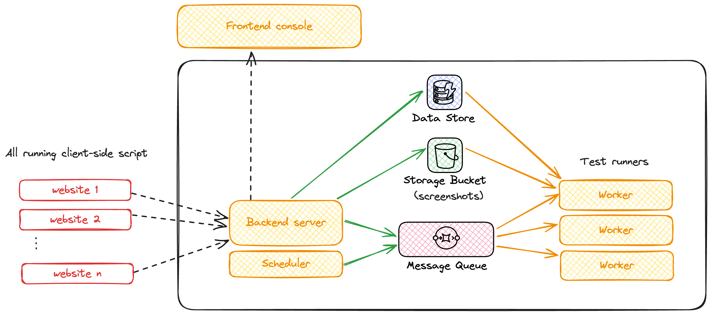

# Paparazzi 📸

*End-to-end UI test automation system*

Paparazzi allows users to record user flows on the frontend, taking automated screenshots of the UI, and comparing them as the system evolves.

## Idea

The idea is to allow someone like a product manager to open a website in a non-production environment and record some user flows, which will automatically become an E2E test. This test can then run at a fixed interval, comparing the flow as the system evolves. Any failure can automatically raise alerts to notify about any breaking user flows.

## System components

The system is composed of 2 major components:

### Backend

The backend server:
- provides REST APIs for different resources
- records test steps, using a headless browser, taking screenshots wherever necessary
- perform test runs to compare new screenshots with existing ones after fixed intervals

### Client script

A client-side script that can be added to any website to show the paparazzi popup UI and to start test recordings

## Architecture

#### Infrastructure components

- **AWS SQS** - message queue to schedule recordings and test runs
- **AWS S3** - storage bucket for screenshots
- **AWS DynamoDB** - the data store

## Flow

1. Select a test run schedule - daily, weekly or monthly
2. Start a test recording on a website and perform user flows
    - Client script captures all the relevant events as test steps from the frontend
    - Events include clicks, inputs, scrolls, page navigations, etc
    - Test steps are sent to the backend
3. Stop recording
    - Once recording is stopped, a task is queued in the message queue to take recording screenshots
    - A worker picks the task from the queue, opens the website in a headless browser window (with the same dimensions as the test performer) and performs all test steps, taking screenshots wherever necessary
    - Screenshots are stored in the storage bucket for future reference
    - A test run is scheduled according to the option chosen in step 1 and a test run message is queued
    - A worker picks this message from queue and runs the same test again, comparing new screenshots with the ones stored earlier
    - The worker marks the test as successful/failed based on the result of the comparisons

### Screenshot comparison

Screenshot comparisons are made using an open-source library [pixelmatch](https://github.com/mapbox/pixelmatch) with a fixed threshold sensitivity.

